<!-- @format -->

# 嵌入式控制系统

> ### 什么是嵌入式控制系统：面向特定应用，完全嵌入受控器件内部，软硬件可配置，对性能、功能、可靠性、成本、体积、功耗有严格约束的计算机系统。

&nbsp;

> ### 特点：专用紧凑、可裁剪性、技术密集、安全可靠、实时性强、开发困难、不可垄断、成本敏感

&nbsp;

## 选型

- 步骤

  - 分析需求
  - 选择主处理器
  - 选择外围设备
  - 选择操作系统
  - 绘制外围功能框图
  - 绘制流程图

- ### 处理器选型

  - 硬件资源(功能):芯片结构、功能`外设`

  - 运算能力(性能):`内核位数、工作频率(运行速度)、存储空间`

  - 成本核算(成本):`购买成本、开发成本`

  - 结构布局(体积):封装形式、引脚配置

&nbsp;

- ### 各个通讯接口特点

  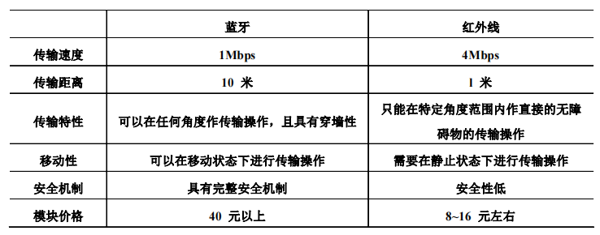
  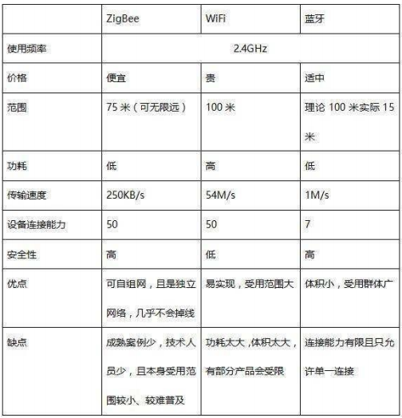

  - 有线通信接口

    - #### RS-232

      - 接口电平值较高，易损换接口电路芯片。要使用电平转换电路才能与 TTL 电路连接，抗干扰能力差。
      - 传输最大距离 15m，最大速率 20KB/s。
      - 总线上只允许连接 1 个收发器，不支持多站收发。
      - 可连接各种设备，功能与 USB 接近。解决 USB 接口不能远距离传输的缺点。

    - #### RS-422

    - #### RS-485

      - 接口电平比 232 低，不易损坏接口电路芯片，与 TTL 电平兼容，抗干扰能力强。效率比 232 低。
      - 传输最大距离 1200m，最大速率 10Mbps。
      - 总线允许连接 128 个收发器，具备多站通信能力。

    - #### 以太网
      - 通信距离 100m

  - 无线通信接口

    - #### 红外线
      - 价格便宜
      - 通讯距离短，1m 以内。速度较慢，4Mbps。
      - 方向性强，不能穿过障碍物，易受热源干扰。静止状态下工作，安全性低。
    - #### 蓝牙(中短距离最优选)
      - 功耗低
      - 价格比红外线高
      - 通讯距离比红外线长，10m，速度比红外线慢 1Mbps
      - 方向性弱，具有穿墙性，可以在移动状态下传输，有完整的安全机制。
    - #### GPRS

      - 支持点到点、点到多点服务
      - 支持短消息业务和标准数据通信协议应用
      - 永远在线，按量计费
      - 相较于 GSM，GPRS 传输效率更高。密码算法经过优化。

    - #### 802.11

      - 无线局域网的通信标准
      - 短距离传输

    - #### ZigBee
      - 价格便宜
      - 通讯距离可无限远(75m)，传输速度 250KB/s
      - 功耗低
      - 安全性高
      - 落地范围小，难普及

&nbsp;

- ### 嵌入式操作系统选型

  - 内核大小与性能: 稳定性、实时性、功耗

  - 外挂组件的丰富性: 驱动、文件系统、网络协议栈、图形界面管理、电源管理、POSIX、标准兼容接口

  - 可裁剪性: 满足对有限资源的约束，可裁剪粒度越小，用户灵活性越大。

  - 对不同平台的可移植性: 处理器种类、提供 BSP 模板、外围驱动的数量

  - 开发环境的完备性: 有好的交叉开发工具、交叉开发工具的集成性与开放性

  - 服务与价格: 维护

&nbsp;

- ### 各个操作系统特点

  - #### VxWorks

    - 功能稳定、可靠，实时性高
    - 提供完整方便的开发调试工具
    - 配套完善的技术支持和售后服务
    - 丰富的外挂组建模块(各种驱动、文件系统、网络协议、图形界面管理、Flash 文件系统)
    - 可裁剪
    - 可以移植性高(为 ARM、X86、MIPS 等处理器提供 BSP 模块及外围硬件设备的驱动程序)
    - 优秀的项目管理能力
    - 支持应用程序动态链接和动态下载
    - 提供目标仿真器
    - 支持系统级和任务级两种调试方式
    - 价格昂贵

  - #### Window CE

    - 功能稳定、可靠
    - 提供完整方便的开发调试工具
    - 配套完善的技术支持
    - 提供丰富的功能模块组件，尤其是图形界面接口 GUI 和多媒体方面有显著优势，适用于信息设备。
    - 特工与 Windows 平台相似的集成开发环境和 API 接口函数，使 Windows 开发人员能够迅速转移到嵌入式系统开发上来，节省了开发者使用新工具、适应新环境的成本。
    - 价格昂贵
    - 内核较大、对硬件要求高，消耗资源多，耗电量大。
    - 支持的处理器种类、提供的驱动程序不够丰富
    - 售后服务力量弱

  - ### `Embedded Linux`

    - 价格方面有优势
    - 模块化体系结构、各模块具有可裁剪性、安全可靠
    - 强大的文件系统、网络协议模块、窗口管理器等
    - 支持多处理器平台
    - 特工 GUN 开发套件、支持动态连接
    - 源代码开放免费
    - 内粉较大，占用内存资源多
    - 未能提供图形化多线程调试工具
    - 缺乏完善的集成开发调试工具
    - 稳定性与服务方面存在挑战

  - ### `μC/OS`

    - RTOS 实时操作系统，具有良好的实时性能，和基于优先级的抢占式调度算法
    - 内核具有较高的稳定性和可靠性
    - 功能模块方面已扩充了文件系统、TCP/IP 协议栈、GUI 等软件包
    - 内核结构小巧、具有可裁剪性
    - 实时性强但是不支持时间片，多任务划分不方便
    - 移植到不太常用的处理器需要自己写 BSP 程序和驱动软件,工作量大
    - 缺乏完善的集成开发调试工具
    - 没有专门人员维护系统，缺乏技术支持

  - #### windows NT

    - 内核代码量少，提高了稳定性、安全性、可维护性
    - 方便进程统一调度，支持分布式
    - 性能较低

  - #### QNX

    - 内核代码量少，提高了稳定性、安全性、可维护性
    - 方便进程统一调度，支持分布式
    - 性能较低

  - #### Minix

    - 内核代码量少，提高了稳定性、安全性、可维护性
    - 方便进程统一调度，支持分布式
    - 性能较低

  - #### HarmonyOS
    - 微内核
      - 确定时延引擎
      - 高性能 IPC
    - 全场景
    - 分布式设计
      - 分布式软总线
      - 分布式设备虚拟化
      - 分布式数据管理
      - 分布式任务调度

&nbsp;

- ### 嵌入式软件特点
  - 实时性: 环境特定、快速启动
  - 异步事件并发处理: 多任务、事件随机性
  - 应用/操作系统一体化
  - 应用固话: 不可修改
  - 实用性: 面型行业、定向开发
  - 适用性: 可裁剪、适应应用
  - 鲁棒性: 容错、出错恢复
  - 够用即可: 成本、资源
  - 可信度: 安全、防危、可靠

## ARM 内核与处理器

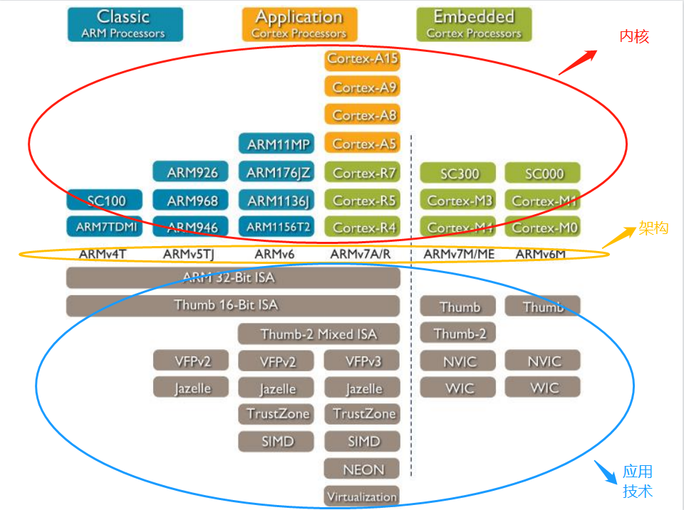

内核和处理器可以混为一谈吗？
我认为不可以，处理器应该可以有多个内核
内核是处理器的核心芯片，指令集架构是内核的地基。

- ### 嵌入式处理器种类

  - #### MPU

    - ARM
    - Power PC

  - #### MCU

    - 单片机

  - #### DSP

    - 数字信号处理
      - 数字滤波、傅里叶变换、频谱分析
    - 多媒体信号
      - 语音识别、移动电话
    - 智能化
      - 生物特征识别
    - DSP 与 MCU 的区别
      - DSP 结构上特征包括哈佛总线结构、流水线、专用硬件乘法器、专用 DSP 指令、片内存储特殊结构和专用寻址单元。

  - #### SoC

&nbsp;

## 外设接口

- ### 实时时钟

  - RTC 晶振

    - 位于芯片外部

  - RC 振荡器
    - 位于芯片内部，会有温飘，对外界干扰敏感

- ### 存储设备

  - #### RAM

    - #### SRAM

      - RS 触发器
      - 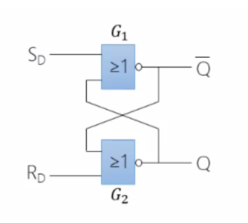

    - #### DRAM

    - #### SDRAM

      - 一个时钟周期的上升沿传输一次数据

    - #### DDR
      - 一个时钟周期的上升沿和下降沿传输两次数据

  - #### ROM

    - #### ROM

      - 数据可读取，不能任意修改
      - 掉电数据不丢失

    - #### PROM

      - 用户有一次机会修改资料

    - #### EPROM

      - 只读存储器
      - 电可编程
      - 紫外线擦出
      - 适用少量生产或产品开发

    - #### EEPROM

      - 电可编程
      - 电可擦除

    - #### FLASH

      - 是 EEPROM 的延伸产品。
      - 区别是

        - 擦除操作不同
        - 寻址方式不同
        - 存储单元结构不同

      - #### NOR

        - 以编码为主，功能与运算相关

      - #### NAND
        - 存储资料

- ### 输入设备

  - #### 小型键盘

    - 逐列检测，逐行输出
    - 译码、消抖、存如寄存器
    - 软件消抖：延时程序

  - #### 触摸屏

    - #### 电容式

      - 对环境污染物有抵抗力
      - 人体作为贿赂的一部分，漂移现象严重
      - 不能戴手套
      - 外界有电感和磁场时会失灵
      - 适用于民用嵌入式设备

    - #### 电阻式
      - 高解析度，高速传输反应
      - 表面硬度处理，减少擦伤、刮伤、防化学处理
      - 具有光面及雾面处理
      - 一次校正、稳定性高、永不漂移

- ### 输出设备

  - #### LED

    - 特点：耗电少、成本低、配置灵活、安装方便、寿命长
    - 发光二极管(基本单元)
    - 数码管
      - 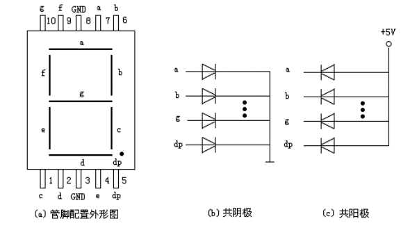
      - 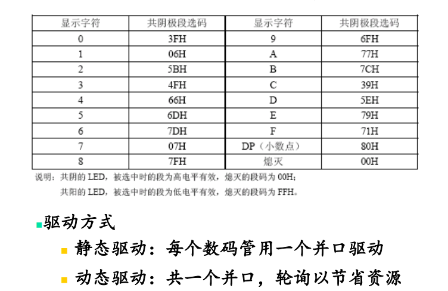
    - 符号管、米字管、点阵显示屏

  - #### LCD
    - 特点：体积小、重量轻、省电、低辐射

- ### 外设接口

  - #### I2C

    - 组成：两根串行线，串行时钟线(SCL)和串行数据线(SDA)
    - 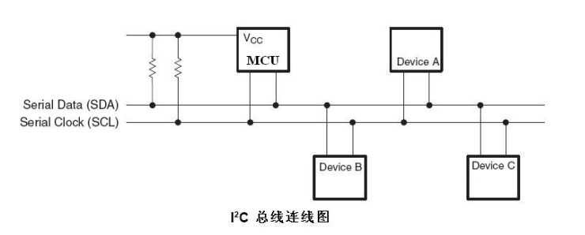

    - 开始：SCL 高电平，SDA 下降沿信号表示开始

    - 地址：第一个字节的头 7 位组成了从机地址，最低位是第 8 位，第 8 位是 0 表示主机向从机写信息，1 表示主机从从机读信息

    - 停止：SCL 高电平，SDA 上升沿信号表示停止

  - #### I2S

    - 组成：三根串行线，时钟线(CSK)、字选择线(WS)和数据通道线(SD)

    - 音频的每一位数据对应 CSK 的 1 个脉冲

    - WS 为 1 表示左声道的数据，0 表示右声道的数据

    - 数据用二进制补码表示

  - #### USB

    - 连接外设不必打开机箱
    - 允许热插拔
    - 采用级联方式
    - 自取电

  - #### SPI

- ### 通讯接口

  - #### 串行通信接口
  - 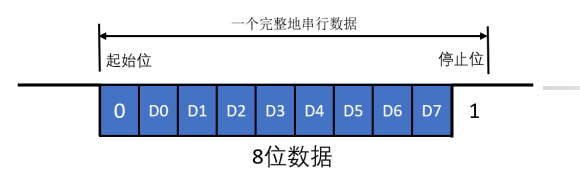

    - 起始位

      - 持续一个 bit 时间的低电平

    - 数据位

      - 先传送字符的低位，后传送字节的高位

    - 奇偶校验位

      - 不是必须要有的，奇校验，要保证总共奇数个高电平；偶校验，要保证总共偶数个高电平

    - 停止位

      - 可以是 1 位或 2 位。当它为高电平传输结束

    - 空闲位

      - 是指上一个停止位到下一个起始位之间的空闲状态，用高电平填充

    - 波特率
      - 单位时间内载波调制状态改变的次数来表示，收发端的波特率要相同

  - #### 有线通信接口

    - RS-232

    - RS-422

    - RS-485

    - 以太网

      - 通信规范协议

        - IEEE802.3(十兆以太网 10Mbps)
        - IEEE802.3u(快速以太网 100Mbps)
        - IEEE802.3z(千兆以太网 1000Mbps)
        - IEEE802.3ae(万兆以太网 10000Mbps)

      - 通信介质标准
        - 10Base-5
        - 10Base-2
        - 10Base-T
        - 10Base-F(光纤)
        - 数字表示传输速度，Base 表示基带，最后的数字表示单段网线长度(基准单位 100m)，T 表示承载信号的物理介质是双绞线缆。F 表示光纤

  - #### 无线通信接口

    - 红外线

    - 蓝牙

    - GPRS

    - 802.11

    - ZigBee

&nbsp;

## 模拟量输入输出通道及信号调理

- 信息种类

- 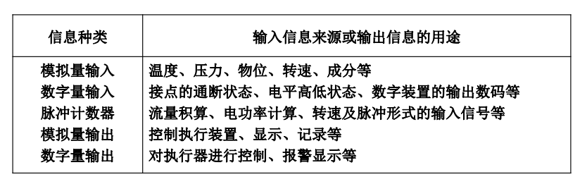

- 模拟量输入通道

- 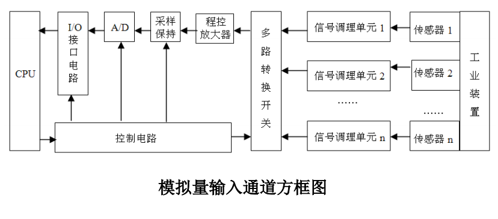

  - 信号调理单元(变送器)

    - 放大、电平变换、电隔离、阻抗变换、线性化、滤波

  - 多路转换开关

  - 采样保持器

  - A/D 转换器

- 模拟量输出接口与通道

  - 模拟量输出通道

    - 常用的信号标准
      - 4~20mA
      - 0~5V
      - -5~0~+5V
      - 0~10V
      - -10~0~+10V

  - D/A 转换器及其接口

&nbsp;

## 数字量输入输出通道及信号调理

- 开关量种类

  - 电平式(高/低)
  - 触电式(闭合/断开)
  - 有原式(高低电平)
  - 无源式(物理触点)

- 数字量输入通道

  - 信号调理
    - 电平转换、滤波、隔离、过电压保护

- 数字量输出通道

&nbsp;

## 过程通道的抗干扰与可靠性设计

- 干扰来源

  - 电源干扰

  - 空间干扰

    - 静电干扰、电场干扰
    - 磁场干扰、电磁辐射干扰
    - 太阳辐射电磁波、雷电造成过电压

  - 设备干扰
    - 电气设备漏电、接地系统不完善
    - 若干线路公用一根电缆产生电磁感应干扰

- 干扰耦合方式

  - 直接耦合
  - 静电耦合
  - 电磁场辐射耦合

- 抗干扰措施

  - 输入过程的预处理

    - 数字滤波

      - 限幅滤波(抗随机脉冲)
      - 中位值滤波(抗随机脉冲)
      - 算术平均滤波(抗随机脉冲)
      - 递推平均滤波(抗周期性干扰)
      - 加权递推平均滤波(用于纯延迟较大的被控对象)

    - 标度变换

    - 线性化处理

    - 标度变换

    - 系统误差自动校准

&nbsp;

## 测量数据的预处理与滤波技术

- 数字滤波
  - 限幅滤波
  - 中位值滤波
  - 算数平均滤波
  - 递推平均滤波
  - 加权递推平均滤波

&nbsp;

## 嵌入式操作系统种类

- #### 实时操作系统(RTOS)

  - 性能特征

    - 多任务运行方式
    - 基于优先级的抢占式调度
    - 快速的任务上下文切换
    - 较短的中断延迟时间

  - VxWorks
  - μC/OS-II

- #### 软(非)实时操作系统

  - Window CE
  - Embedded Linux

- #### 商用型嵌入式操作系统

  - VxWorks
  - Window CE

- #### 免费性嵌入式操作系统

  - Embedded Linux
  - μC/OS-II

- #### 开放源码型

  - Embedded Linux
  - μC/OS-II

- #### 黑箱型
  - Window CE

&nbsp;

## RTOS

- 概念

  - 任务

    - 任务名
    - 任务号
    - 任务当前状态
    - 任务优先级
    - 任务上下文(寄存器、堆栈、指针)
    - 任务周期
    - 任务执行时间
    - 任务截止时间

  - 线程

  - 抢占

  - 互斥

  - 优先级驱动

  - 优先级逆转

  - 上下文切换

- 体系结构

  - 单块结构
    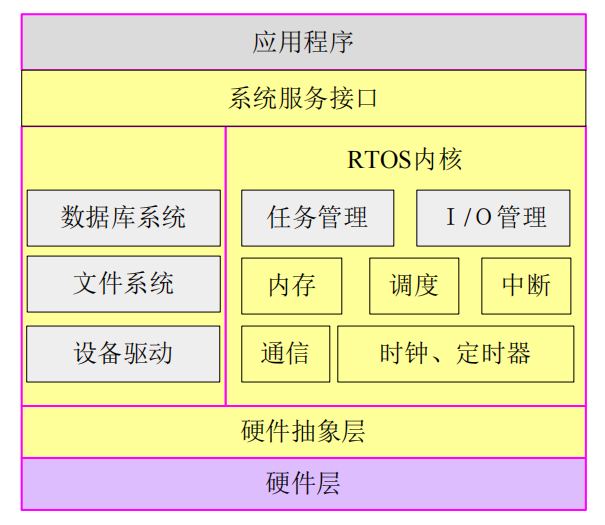

  - 层次结构
    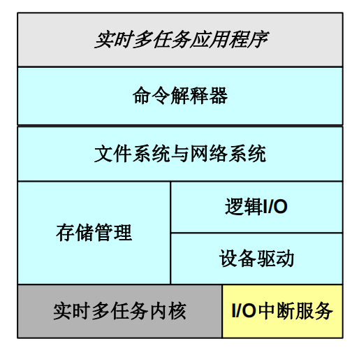

  - 微内核结构
    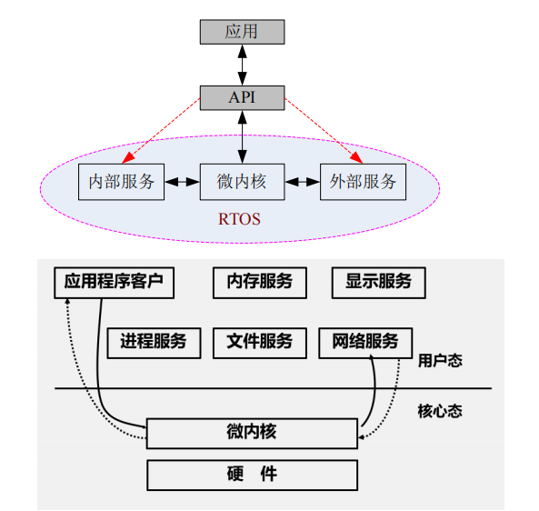

    - 优点
      - 对外提供一致的接口
      - 可扩展性
      - 更好的灵活性和可移植性
      - 支持分布式系统

  - 构件结构
    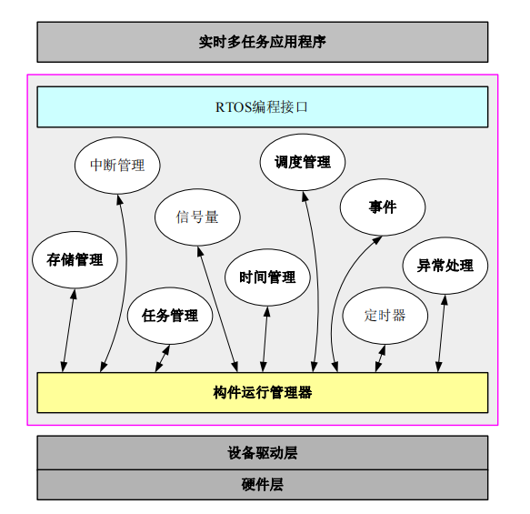

  - 多核结构
    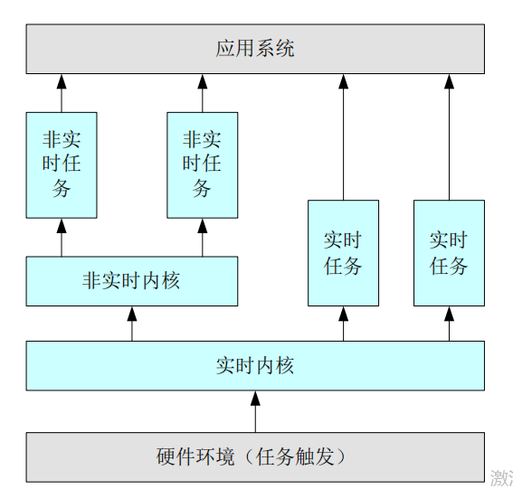

- #### 实时内核

  - #### 任务切换与任务状态
  - 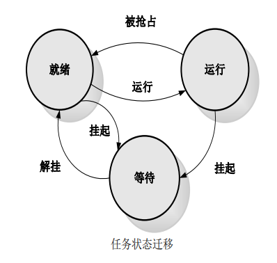

  - #### 优先级逆转与死锁

    - 避免方法

      - #### 优先级继承
      - 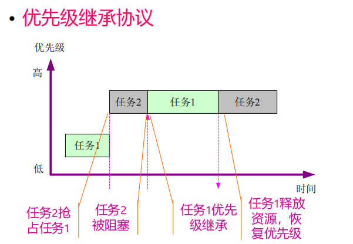

      - #### 优先级天花板
      - 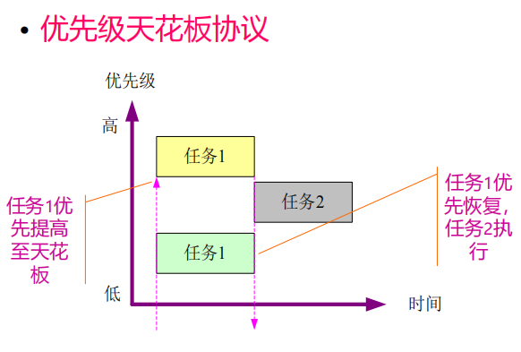

      - 两种协议比较
        - 继承可能要修改，天花板只需要修改一次，后者效率更高
        - 天花板会阻塞中间优先级任务

  - #### 中断

    - 作为任务切换
    - 作为系统调用
    - 作为前台任务

  - #### 时钟管理

  - #### 内存管理
    - 采用静态内存非配和动态内存非配相结合的管理方式

- #### 扩展组件

  - #### 嵌入式 GUI

    - MicroWindows
    - MiniGUI
    - QT
    - OpenGL

  - #### 嵌入式网络

    - 无线应用协议
    - 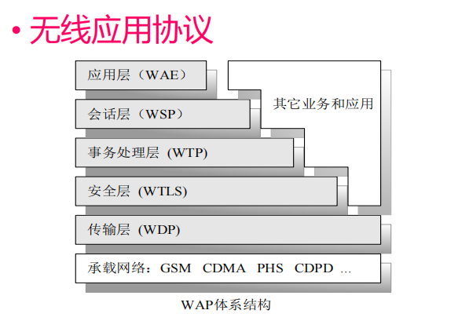

    - 现场总线
    - 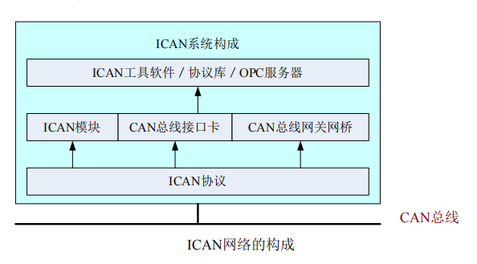

    - 无线传感器网络

  - #### 嵌入式数据库

  - #### 功耗管理
    - DPM 技术
    - EVS 技术
    - 存储器功耗管理技术

&nbsp;

## 嵌入式软件运行流程

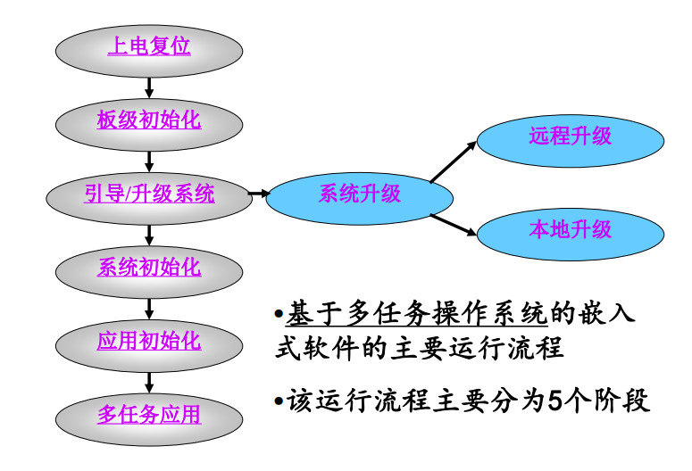

- 板级初始化阶段

  - #### 板级支持包(BSP)

    - 负责上电时硬件初始化、启动 RTOS 或应用程序模块、提供底层硬件驱动

    - BSP 与 BIOS 的区别
      - BIOS 没有设备的驱动程序
      - BIOS 不可修改

- 引导阶段

  - #### BootLoader

    - 将内核从外部存储介质拷贝到内存中，并跳转到内核的首条指令

    - #### U-Boot
      - 开放源码
      - 支持多个处理器系列
      - 较高的稳定性和可靠性
      - 高度灵活的功能设置
      - 丰富的设备驱动源码
      - 较为丰富的开发调试文档和网络技术支持

  - 三种引导情况

    - 1. 系统软件从 NOR Flash 中独取出来加载到 RAM 中运行

      - 使用 BootLoader
      - 运行速度快、启动速度慢

    - 2. 系统软件从外存(NAND Flash\CF 卡\MMC)中独取出来加载到 RAM 中运行

      - 使用 BootLoader
      - 运行速度快、启动速度慢

    - 3. 系统软件直接在 NOR Flash 上运行进入系统初始化阶段
      - 不使用 BootLoader
      - 启动速度快、运行速度慢

- 初始化阶段

  - 按照一定顺序进行初始化

    - 1. 内核
    - 2. 网络、文件系统等
    - 3. 其他组件

  - 进行应用任务的创建，信号量、消息队列的创建、应用相关的其他初始化工作

&nbsp;

## 嵌入式软件

- 关注

  - 并发任务之间的协作关系
    - 互斥问题
    - 同步问题
  - 信息隐藏
    - 人物之间、模块之间接口
    - 消除全局变量、各类信息封装不同模块、增加复用性

- 常规设计方法
  - 语言描述
  - 数学分析
  - 流程图
  - 结构图
  - 伪代码
  - 有限状态机
