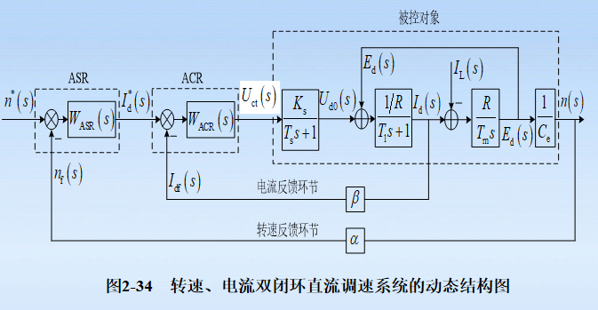

<!-- @format -->

# 运动控制系统

- 直流斩波器(脉宽调制变换器)

  - 
  - > VT 为电力电子开关器件
  - > VD 为续流二极管
  - 公式
    - $U_d = \frac{t*{on}}{T}U_s = \rho U_s$
    - > T 为晶闸管的开关周期
    - > $t_{on}$ 为开通时间
    - > $\rho$ 为占空比

## 直流调速

- 公式

  - $n = \frac{U - IR}{K_e\Phi}$
  - > $K_e$ 为电动势常数
  - > $\Phi$ 为励磁磁通

  - $T_e = \frac{9550P_e}{n}$

- 方法

  - 变电压
  - 变电阻
  - 变磁通

- ### GM 系统

  > G 为直流发电机  
  > M 为直流电动机

  - 系统特性

    

- ### VM 系统

  > V 为晶闸管可控整流器  
  > M 为直流电动机

  - **VM 系统原理图**

    

  - > GT 为触发装置
  - > VT 为可控整流器

  - **理想公式**

    - $U_d = K_sU_{ct}$

    - 
    - > $U_d$ 为平均整流电压
    - > $U_{ct}$ 为控制电压
    - > $K_s$ 为晶闸管整流器放大倍数
      - 放大倍数估算
        - $U_c$ = 0~10V
        - $U_d$ = 0~220V
        - 则 $K_s = \frac{220}{10} = 22$

  - **晶闸管装置的传递函数**

    - 
    - 公式
      - $W_s(s) = \frac{U_{d0}(s)}{U_c(s)} = K_se^{-T_ss}$
      - 泰勒展开
        - $K_se^{-T_ss} =\frac{K_s}{1 + T_ss + \frac{1}{2!}T_s^2s^2 + \frac{1}{3!}T_s^3s^3 + ...}$
      - 近似为一阶惯性环节
        - $W_s(s) =\frac{K_s}{1 + T_ss}$

  - **主电路等效结构图**

    - 
    - > $U_{d0}$ 即为整流器输出 ?? 还是输入

  - **等效结构图电压平衡方程**

    - $u_{d0} = E + i_dR + L\frac{di_d}{d_t}$
    - > E 为电动机反电势
    - > $i_d$ 为整流电流瞬时值
    - > L 为主电路总电感
    - 

  - **VM 系统机械特性**

    - 公式
      - $n = \frac{1}{C_e}(U_{d0} - I_dR)$
      - > $C_e$ 为电动势系数
      - 
      - > 改变触发相位 -> 改变$U_{d0}$ -> 得到一族平行线

  - **晶闸管整流器存在的问题**

    - 只能单向导通，给可逆运行带来困难
    - 对过电压、过电流极为敏感，很易损坏晶闸管
    - 在交流侧会产生较大的谐波，引起电网电压的畸变

- ### 直流 PWM 变换器

  - #### 不可逆 PWM 变换器

    - **主电路原理图**

    - 
    - > $U_s$ 为直流电压电源
    - > C 为滤波电容器
    - > VT 为功率开关器件
    - > VD 为续流二极管
    - > M 为直流电动机

    - **公式**

      - $U_d = \frac{t_{on}}{T}U_s = \rho U_s$
      - > T 为晶闸管的开关周期
      - > $t_{on}$ 为开通时间
      - > $\rho$ 为占空比
      - $\gamma = \frac{U_d}{U_s}$
      - > $\gamma$ 为 PWM 电压系数
      - $\gamma = \rho$

    - **机械特性**

      - 
      - 公式
        - $n = n_0 - \frac{R}{C_e}I_d = n_0 - \frac{R}{C_eC_m}T_e$
        - > $C_m$为转矩系数

    - **一般情况**

    - 

      - 电动状态

        - 回路 1
        - 回路 2

      - 制动状态
        - 回路 4
        - 回路 3

    - **输出波形**

      - 
      - 

    - **轻载状态**

      - 电动状态
        - 阶段 4
        - 阶段 1
      - 制动状态
        - 阶段 2
        - 阶段 3

    - **总结**

      - 

  - #### 桥式可逆 PWM 变换器

    - **主电路原理图**

    - 

    - **公式**

      - $U_d = \frac{t_{on}}{T}U_s - \frac{T-t_{on}}{T}U_s = (\frac{2t_{on}}{T}-1)U_s$
      - $\gamma = 2\rho-1$
      - > 这里的$\gamma$与不可逆变换器中的不一样

    - **调速范围**

      - $\rho$ 的可调范围为 0~1
      - $\gamma$ 的可调范围为-1~+1
      - > 电机正传，$\gamma$ 为正，$\rho>0.5$
      - > 电机反转，$\gamma$ 为负，$\rho<0.5$
      - > 电机停止，$\gamma$ 为 0，$\rho=0.5$

    - **一般情况**

      - 正向运行

        - 回路 1
        - 回路 2

      - 反向运行
        - 回路 4
        - 回路 3

    - **输出波形**

      - 

- ### (开环)直流调速系统

  - #### 旋转电枢系统

    - **电枢回路**

      - 等效电路
      - 

      - 电压电流的公式

        - $U_{d0} = RI_d + L\frac{dI_d}{dt} + E_d$

      - 电压电流的传递函数

        - $\frac{I_d(s)}{U_{d0}(s)-E_d(s)}=\frac{\frac{1}{R}}{1+T_1s}$
        - > $T_1 = \frac{L}{R}$ 为时间常数

      - _电压电流的模型_
      - 

      - 电流电动势的公式

        - $U_{d0} = RI_d + L\frac{dI_d}{dt} + E_d$

      - 电流电动势的传递函数

        - $\frac{E_d(s)}{I_{d0}(s)-I_L(s)}=\frac{R}{1+T_ms}$
        - > $T_m=\frac{GD^2R}{375C_eC_m}$ 为机电时间常数

      - _电流电动势的模型_
      - 

    - **电力电子变换器**

      - 晶闸管-电机调速系统(V-M 系统)

        - 晶闸管-电机调速系统传递函数

          - $W_s(s)=\frac{K_s}{1+T_ss}$

        - 晶闸管-电机调速系统模型

        - 

      - 不可逆直流 PWM 变换器

        - 不可逆直流 PWM 变换器传递函数

          - $W_s(s)=K_s$

        - 不可逆直流 PWM 变换器模型
        - 

    - **励磁回路**

      - 励磁绕组回路

        - 忽略磁场回路涡流影响时的传递函数

          - $W_s(s)=\frac{K_f}{1+T_fs}$
          - > $R_f$ 为励磁回路电阻
          - > $L_f$ 为励磁回路电感
          - > $T_f$ 为励磁回路时间常数

        - 忽略磁场回路涡流影响时的模型
        - 

        - 考虑磁场回路涡流影响时的传递函数

          - $\frac{I_f}{U_f} = \frac{1+T_ks}{R_f(1+T_{fb}s)}$
          - > $T_fb=(T_k+\frac{L_\Phi}{R_f}$ 为时间常数
          - $\frac{I_\Phi(s)}{I_f(s)}=\frac{1}{1+T_ks}$

        - 考虑磁场回路涡流影响时的模型
        - 

      - 触发器与整流电路

        - 触发器与整流电路传递函数

          - $W_{sf}(s)=\frac{K_{sf}}{1+T_{sf}s}$

        - 触发器与整流电路模型`
        - 

- ### 转速单闭环直流调速系统

  - #### 转速单闭环直流调速系统原理图

    - **V-M 单闭环**直流调速系统原理图
    - 

    - **PWM-M 单闭环**直流调速系统原理图
    - 

    - **V-M 单闭环电流截止负反馈**直流调速系统原理图
    - 

  - #### 转速单闭环直流调速系统模型

    - **V-M 单闭环**直流调速系统模型
    - 

  - **电流截止负反馈**

    - 设置原因
      - 调速系统在启动或堵转时点数电流过大而得不到必须的自动限制

- ### 转速电流双闭环直流调速系统

  - #### 转速电流双闭环直流调速系统原理图

    - **V-M 双闭环**直流调速系统原理图
    - 

    - **PWM-M 双闭环**直流调速系统原理图
    - 

  - #### 转速电流双闭环直流调速系统模型

    - **V-M 双闭环**直流调速系统模型
    - 

- ### 闭环直流调速系统稳态分析

  - #### 静态指标

    - **调速范围(D)**

      - $D=\frac{n_{max}}{n_{min}}$
      - > $n_{max}$ 为最高转速
      - > $n_{min}$ 为最低转速

    - **静差率(s)**

      - $s=\frac{\Delta n_N}{n_{0min}}$
      - > $\Delta n_N$ 为额定速降
      - > $n_{0min}$ 为最低理想空载转速
      - 
      - > ① 与 ② 机械硬度相同，但由于理想空载转速不同，所以静差率不同

      - **调速范围与静差率的关系**

        - $n_{min}=n_{0min}-\Delta n_N=\frac{\Delta n_N}{s}-\Delta n_N=\frac{\Delta n_N(1-s)}{s}$
        - $D=\frac{n_{max}}{n_{min}}=\frac{n_N}{n_{min}}=\frac{n_Ns}{\Delta n_N(1-s)}$
        - > $n_N$ 为额定转速
        - > s 越小，D 越小

  - #### 单闭环直流调速系统稳态分析

    - **ASR 为比例调节器**单闭环直流调速系统(静差调速系统)

      - 原理图
      - 
      - 

      - 稳态特性方程

        - $n=\frac{K_pK_sU_n^*}{C_e(1+k)}-\frac{RI_d}{C_e(1+k)}=n_{0cl}-\Delta n_{cl}$
        - > $K_p$ 为比例调节器放大系数
        - > $K_s$ 为电力电子变换器变换系数
        - > $n_{0cl}$ 为闭环系统的理想空载转速
        - > $\Delta n_{cl}$ 为闭环系统的稳态速降

      - 对比开环与闭环的特性指标

        - 稳态速降
          - $n=\frac{K_pK_sU_{ct}}{C_e}-\frac{RI_d}{C_e}=n_{0op}-\Delta n_{op}$
          - > $n_{0op}$ 为开环系统的理想空载转速
          - > $\Delta n_d$ 为开环系统的稳态速降
        - > 转速闭环后在通易付在下稳态速降降低考开环系统的$\frac{1}{1+k}$ 倍

        - 调速范围
          - $D_{cl}=\frac{n_Ns}{\Delta n_{cl}(1-s)}=\frac{n_Ns}{\frac{\Delta n_{op}}{1+K}(1-s)}=(1+K)D_{op}$
        - > 相同静差率下，转速闭环后调速范围提高到开环的(1+K)倍

    - 对比开环与闭环的机械特性
    - 
    - > ①②③④ 为开环机械特性
    - > ⑤ 为闭环机械特性
    - > A->A'->B->B'->C->C'->D

    - **ASR 为比例积分调节器**单闭环直流调速系统(无静差调速系统)

      - 原理图
      - 
      - 

      - 稳态特性方程

        - $n=n_0 = \frac{U_n^*}{\alpha}$
        - $\alpha = \frac{U_{nmax}^*}{n_{max}}$
        - > $\alpha = \frac{U_n^*}{n}$ 为转速反馈系数
        - > $n_{max}$ 为最高转速
        - > $U_{nmax}^*$ 为 $n_{max}$ 对应的最大给定电压

      - 闭环机械特性
      - 

    - **ASR 为比例积分调节器**,*带电流截止负反馈*单闭环直流调速系统

      - 原理图
      - 

      - 稳态特性方程

        - 当$I_d ≤ I_{dcr}$
          - $n = n_0 = \frac{U_n^*}{\alpha}$
        - 当$I_d ＞ I_{dcr}$
          - $n = \frac{U_n^*}{\alpha}-\frac{U_{com}}{\alpha}-\frac{\beta}{\alpha}I_d$

      - 机械特性
      - 

  - #### 双闭环稳态分析和计算

    - **ASR 为比例积分调节器,ACR 为比例积分调节器**双闭环直流调速系统

      - 原理图
      - 

      - 稳态特性方程

        - 转速调节器不饱和
          - $n = n_0 = \frac{U_n^*}{\alpha}$
        - 转速调节器饱和
          - $I_d = I_{dm} = \frac{U_{im}^*}{\beta}$

      - 机械特性
      - 

- ### 闭环直流调速系统动态分析

  - #### 动态指标

  - **上升时间**($T_r$)
  - **超调量**($\sigma$)
    - $\sigma=\frac{C_{max}-C_∞}{C_∞}$
    - > $C_∞$ 为稳态值
  - **调节时间**($T_s$)
    - 
  - **最大动态变化量**
    - $\frac{\Delta C_{max}}{C_{∞1}}$
    - > $C_{∞1}$ 为原稳态值
  - **恢复时间**($T_v$)

    - 
    - > $C_{∞2}$ 为新稳态值

  - #### 频域指标

    - **相角裕量**($\gamma$)
    - **截止频率**($\omega_c$)
    - **闭环幅频特性峰值**($M_r$)
    - **闭环特性通频带**($\omega_b$)

  - #### 单闭环直流调速系统动态分析

    - **ASR 为比例调节器**单闭环直流调速系统(静差调速系统)

      - 传递函数

        - 开环传递函数
          - $W_{op}(s)=\frac{\frac{K_pK_s\alpha}{C_e}}{(T_ss+1)(T_mT_1s^2+T_ms+1)}$
        - 闭环传递函数
          - $W_d(s) = \frac{W_{op}(s)\alpha}{1+W_{op}}=\frac{\frac{K_pK_s}{C_e(1+K)}}{\frac{T_mT_1T_s}{1+K}s^3+\frac{T_m(T_1+T_s)}{1+K}s^2+\frac{T_m+T_s}{1+K}s+1}$

      - 稳定条件

        - $K<K_{cr}$
        - > $K_{cr}=\frac{T_m}{T_s}+\frac{T_m}{T_s}+\frac{T_m}{T_s}$ 为临界放大系数

      - 单有扰动情况下的稳态误差
        - $\Delta U_n=\frac{RI_{dL}}{C_e(1+K)}$
      - > 说明 ASR 为比例调节器的单闭环直流调速系统对扰动而言 s 是有稳态误差的

    - **ASR 为比例积分调节器**单闭环直流调速系统(无静差调速系统)

      - 传递函数

        - 开环传递函数

          - $W_{op}(s)=K_{PI}\frac{\tau_{id}+1}{\tau_{id}s}\frac{K_s}{T_s+1}\frac{\alpha}{C_e(T_mT_1s^2+T_ms+1)}$

        - 闭环传递函数
          - $W_{cl}=\frac{W_{op}\alpha}{1+W_{op}}$

      - 稳定条件

        - K、$\tau_{id}$ 满足如下不等式
          - $(T_1+T_s)(T_m+T_s)-(1+K)T_1T_s>0$
          - $(1+K)[(T_1+T_s)(T_m+T_s)-(1+K)T_1T_s]\tau_{id}-KT_m{(T_1+T_s)}^2>0$
          - $K>0$

      - 单有扰动情况下的稳态误差
        - $\Delta U_n=0$
        - $\Delta n=0$

  - #### 双闭环直流调速系统动态分析

    - **三阶段**

    - 

      - $I$阶段
        - 电流上升阶段，ASR 很快饱和，ACR 不饱和。
      - $II$阶段
        - 恒流升速阶段，ASR 始终饱和，转速环相当于开环，ACR 不饱和。
      - $III$阶段
        - 转速调节阶段，转速上升到给定值$n^*$时，ASR 输入偏差为零，又于积分作用还维持在有限幅值$U_{in}^*$电动机仍然加速，导致转速超调。

    - **三个特点**

      - 饱和非线性控制
      - 转速超调
      - 准时间最优控制

    - **抗扰性能分析**

      - 电网电压扰动

        - 引起电流变化，可以经过电流调节器，维持电流为给定值。由于电流环的惯性远小于转速环的惯性，调节速度快。

      - 负载扰动
        

    - **转速和电流调节器的作用**

      - 串级结构，相互独立，互不干扰
      - 转速调节器 ASR 的作用
        - 调速系统的主导调节器
        - 对负载变化起抑制作用
        - 输出限幅决定电机允许的最大电流
      - 电流调节器 ACR 的作用
        - 使电枢电流紧紧跟随给定值
        - 对电网电压波动及时抗扰
        - 动态过程中保证或的电动机允许的最大电流
        - 过载或堵转时限制电流最大值，起快速自动保护作用

- ### 调节器设计

  - #### 调节器选择

    - 追求动态品质和稳态精度
      - $PI$调节器
    - 追求快速性
      - $PD$调节器或$PID$调节器

  - #### 伯德图

    

    - > 中频段以-20dB/dec 穿越 0dB 线，而且这一斜率能覆盖足够的频带宽度，系统的稳定性好。
    - > 截止频率越高，系统的快速性越好
    - > 低频段斜率陡、增益高，说明系统的稳态精度高
    - > 高频段数案件越快，说明系统抗高频噪声干扰能力越强

  - #### 调节器

    - **PI 调节器**

      - 框图
        
      - 公式
        - $U_{ex}=K_{PI}U_{in}+\frac{1}{\tau}\int U_{in}dt$
      - 传递函数
        - $W_{PI}=K_{PI}+\frac{1}{\tau s}$
      - 输入输出曲线
        

    - **电流自适应调节器**

      - 框图
        
      - 传递函数
        - $W_{ACR}^{'}=\frac{K_s}{K_s^{'}}\frac{1}{\tau_ss}$

    - **转速自适应调节器**

      - 框图
        

## 交流调速

- ### 异步电机调速系统

  - #### 电压频率协调控制方法

    - **恒压频比**

      

      - 基频以下

        - 采用$I_sR_s$补偿定子阻抗压降的影响(转矩提升方法)

        - 机械特性
          

      - 基频以上

        - 为避免$U_s$超过额定值损坏电机绝缘，限制$U_s=U_{sN}$

        - 机械特性
          
        - > 基频以上属于弱磁恒功率调速，最大电磁转矩$T_{eimax}$随着频率的增加呈二次方减小

    - **转差频率控制**

      - 转差频率控制规律
        - $\omega_{s1}≤\omega_{s1max}$，$T_{ei}∝\omega_{s1}$，前提是维持$\Phi_m$恒定不变
        - 按照$I_s=f(w_{s1})$的函数关系来控制定子电流，就能维持$\Phi_m$恒定不变

- ### 电力电子变频调速装置

  - #### 基于稳态模型的异步电动轨变压变频调速系统

    - **电压源型转速开环恒压频比控制的异步电动机变压变频调速系统**

      

    - **电流源型转速开环恒压频比控制的异步电动机变压变频调速系统**

      

    - **电流源型转速闭环转差频率控制的异步电动机变压变频调速系统**

      

  - #### 基于动态模型矢量控制的异步电动轨变压变频调速系统

    - **矢量控制框图**

      
