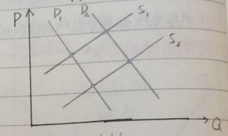

<!-- @format -->

# 西方经济学

## 商品

- 吉芬商品
- 高档炫耀性商品
- 投机性商品
- 低档商品

## 需求

- 影响因素

  - 价格(P)
  - 消费者收入(I)
  - 相关商品价格(Pr)
  - 消费者偏好(W)
  - 消费者对价格变化的预期(Pe)

    

    > 通常收入提高时，需求增加。但低档商品是例外。

- 互补品与替代品

- 

- 需求量与需求

  - 需求量：在给定价格下，买者愿意购买的商品量

    - 其他因素不变时，商品价格变动

    - 

  - 需求：不同价格水平相对应的不同需求量的总和

    - 价格不变时，其他因素变动
    - 需求定理：在其他因素不变时，某种商品的需求量与其价格反向变动

    - 

## 供给

- 影响因素

  - 价格(P)
  - 投入品价格(C)
  - 技术水平(T)
  - 企业对价格变化的预期(Pe)
  - 其他商品价格(Py)

- 供给量与供给

  - 供给量：在给定价格下，卖家可以提供的商品量

    - 其他因素不变时，商品价格变动

      

  - 供给：不同价格水平相对应的不同供给量的总和

    - 价格不变时，其他因素变动

      

## 市场均衡

- 均衡价格：供给量和需求量相等时的价格
- 均衡数量：均衡价格下的供给量和需求量
- 供给与需求的变动

  - 供给不变，需求变化

  - 
  - 需求不变，供给变化

  - 
  - 供给与需求同向变化
    - 供给与需求增加，均衡数量增加，均衡价格不一定
    - 供给与需求减少，均衡数量减少，均衡价格不一定
  - 供给与需求反向变化
    - 供给增加，需求减少，均衡价格减少，均衡数量不一定
    - 需求增加，供给减少，均衡价格增加，均衡数量不一定
  - 

## 弹性

- 需求价格弹性($E_d$)
  - 公式
    - 点弹性
      - $E_d = -\frac{dQ}{dP}\frac{P}{Q}$
    - 弧弹性
      - $E_d = -\frac{△Q}{△P}\frac{P}{Q} = -\frac{Q_2-Q_1}{P_2-P_1}\frac{P_1+P_2}{Q_1+Q_2}$
    - 中点公式
      - $E_d = -\frac{△Q}{△P}\frac{P_1+P_2}{Q_1+Q_2}$
  - 分类
    - 需求完全无弹性
      - `需求量`对价格变动完全`没有反应`
      - $E_d$ = 0
    - 需求无限弹性
      - `需求量`对价格变动`无限大`
      - $E_d$ = ∞
    - 需求缺乏弹性
      - `需求量`对价格变动`小`
      - `谷贱伤农`
      - $E_d$ < 1
    - 需求富有弹性
      - `需求量`对价格变动`大`
      - `薄利多销`
      - $E_d$ > 1
    - 需求为单位弹性
- 需求收入弹性($E_I$)

  - 公式

    - $E_I = -\frac{△Q}{△I}\frac{I}{Q} = -\frac{Q_2-Q_1}{I_2-I_1}\frac{I_1+I_2}{Q_1+Q_2}$

  - 不同物品的$E_I$
    - 奢侈品
      - $E_I$ > 1
    - 必需品
      - 0 < $E_I$ < 1
    - 劣等品
      - $E_I$ < 0

- 供给价格弹性($E_s$)

  - 公式
    - 点弹性
      - $E_s = -\frac{dQ}{dP}$ $\frac{P}{Q}$
    - 弧弹性
      - $E_s = -\frac{△Q}{△P} \frac{P}{Q} = -\frac{Q_2-Q_1}{P_2-P_1}\frac{P_1+P_2}{Q_1+Q_2}$
    - 中点公式
      - $E_s = -\frac{△Q}{△P}$ $\frac{P_1+P_2}{Q_1+Q_2}$
  - 分类
    - 供给富有弹性
      - $E_s$ > 1
      - 劳动密集型商品供给
    - 供给缺乏弹性
      - 0 < $E_s$ < 1
      - 资本密集型商品供给

- 弹性理论应用

  - 税收转嫁

    - 无论向消费者还是生产者征税，`结果都是相同的`

    - 
    - 消费者承担多少取决于供给和需求弹性,`税收负担一般落在缺乏弹性的一方`
    - 

## 效用

- 总效用($TU$)
  - 消费者从物品的消费中得到的总满足程度
- 边际效用($MU$)
  - 其他条件不变，每增加一单位物品消费所带来的总效用的变动量
  - $MU = \frac{△TU}{△Q}$
- 总效用与边际效用的关系
  - 边际效用是总效用的导数
    - $MU$ > 0 , $TU$ 增大，但增加速率递减
    - $MU$ < 0 , $TU$ 减小，但减小速率递减
- `边际效用递减规律`

  - 其他条件不变，给定时间内连续增加一种物品的消费时，商品的边际效用将最终趋于下降

  - 

## 偏好

- 消费者偏好假设
  - 完备性
    - A > B or A < B or A = B
  - 传递性
    - A > B and B > C 则 A > C
  - 非饱和性
    - 消费者总喜欢更多商品，而不是更少
- ### 无差异曲线

  > 形状取决于偏好

  - 表示两种商品不同数量组合给消费者带来的效用没有差异的一条曲线
  - 特点
    - 向右下方倾斜
    - 离远点越远，效用越大
    - 无差异曲线不相交
    - 无差异曲线凸向原点
  - 
  - 两种极端无差异曲线

    - 完全替代品

    - 
    - 完全互补品

    - 

- 边际替代率

  - `计算题万能公式`
    - $MRS_{xy} = -\frac{△Y}{△X} = \frac{MU_X}{MU_Y}$
    - $P_X X + P_YY = 1$
    - $MU_X = Y$
    - $MU_Y = X$

- `边际替代率递减规律`
  - 在保持效用不变的前提下，连续增加某一物品的消费时，消费者所必须放弃另一种物品是递减的
  - 原因
    - $MRS_{xy} = \frac{MU_X}{MU_Y}$
    - 随着 X 商品数量增多，$MU_X$减少，随着 Y 商品数量减少，$MU_Y$增加

## 预算约束线

- 斜率
  - 衡量消费者用 1 单位 X 物品所换到的 Y 物品的数量
- 公式
  - $K = \frac{△Q_Y}{△Q_X} = \frac{P_X}{P_Y}$
- 变动

  - 收入变化

    - 收入增加，预算线向右平移

    - 

  - 价格变化

    - 价格升高，预算线绕价格不变物品的截距向内旋转

    - 

## 消费者均衡

> 在收入和价格既定的条件下，消费者为实现效用最大化对商品组合购买的最优选择

- 最优选择一定在预算线上
- 最优选择切点已定位于最高的无差异曲线上

- 
- `数学表达`
  - $MRS_{xy} = -\frac{△Y}{△X} = \frac{P_X}{P_Y} = \frac{MU_X}{MU_Y}$
  - $P_X X + P_YY = 1$
  - $MU_X = Y$
  - $MU_Y = X$
- 变动

  - 

## 消费者剩余

> 消费者在购买一定数量的某商品时，愿意支付的价格和实际支付价格的差额

- 用消费者取下以下，市场价格以上的面积表示

- 
- 变动

  - 价格变动

  - 

## 生产者行为理论

- 短期生产函数

  - 公式
    - $Q = f(L)$
  - 产量

    - 总产量
      - $TP_L = f(L)$
    - 平均产量
      - $AP_L = \frac{TP_L}{L}$
    - 边际产量

      - $MP_L = \frac{△TP_L}{△L} = \frac{dTP_L}{dL}$
        > 边际产量 = 总产量导数 = 生产函数导数

    - 

  - TP 与 MP 的关系
    - $MP > 0, TP↑$
    - $MP < 0, TP↓$
    - $MP = 0, TPmax$
  - AP 与 MP 的关系

    - $MP > AP, AP↑$
    - $MP < AP, AP↓$
    - $MP = AP, APmax$

  - ### `边际报酬递减规律`(短期生产)
    > 在技术水平不变的条件下，连续增加一种生产要素的投入量，党该要素的增加超过一定限度时，边际产量会递减
    - 举例
      - 一个和尚.两个和尚.三个和尚。
      - 三季稻不如两季稻

- 长期生产函数

  - ### 等产量线(你看像不像无差异曲线)
    > 两种生产要素的不同数量组合可以带来相同产量的曲线
    - 特点
      - 向右下方倾斜
      - 离远点越远，产量水平越大
      - 互不相交
      - 凸向原点
      - 
  - `边际技术替代率`
    > 为了维持相同的产量水平，增加一种生产要素的投入，必须减少另一种生产要素的投入
    - 公式
      - $MRTS_{L,K} = - \frac{△PK}{△L} = \frac{MP_L}{MP_K}$
  - `边际技术替代率递减规律`

    > 在维持产量不变的前提下，当一种要素的投入量不断增加时，每一单位的这种要素所能代替的另一种生产要素的数量是递减的

    - 两种极端
    - 投入要素完全可替代
    - 
    - 投入要素完全不可替代
    - 

  - ### 等成本线

    - 公式
      - $C = wL + rK = P_LL + P_KK$
    - 斜率
      - $K = \frac{△Q_K}{△Q_L} = \frac{P_L}{P_K}$
    - 变动
    - 生产要素最优组合的确定
      - $MRTS_{L,K} = \frac{P_L}{P_K} = \frac{MP_L}{MP_K}$
      - $C = P_LL +P_KK$
      - 
    - 规模报酬
      > 企业同比例变动所有生产要素的投入量所引起的产量变动
      - 三种情况
        - 递增：产量增加的比例大于投入要素增加的比例
        - 递减：产量增加的比例小于投入要素增加的比例
        - 不变：产量增加的比例等于投入要素增加的比例

- ### 短期成本函数

  - 固定成本($FC$)
  - 可变成本($VC$)
  - 总成本($TC$)
    - $TC = FC + VC$
  - 平均成本($AC$)
    - $AC = \frac{TC}{Q} = AFC + AVC$
    - 平均固定成本
      - $AFC = \frac{FC}{Q}$
    - 平均可变成本
      - $AVC = \frac{VC}{Q}$
  - 边际成本($MC$)
    - 短期边际成本与固定成本无关，至于可变成本有关
  - $AC$ 与 $MC$关系
    - 都呈 U 形
    - $MC$与$AC$相交于$AC$最低点
    - $MC$与$AVC$相交于$AVC$最高点

- ### 长期成本函数
  > 企业所有投入要素的数量都可变，企业在各个产量水平上选择最优要素组合条件下形成的产量和成本关系，用于企业长期规划
