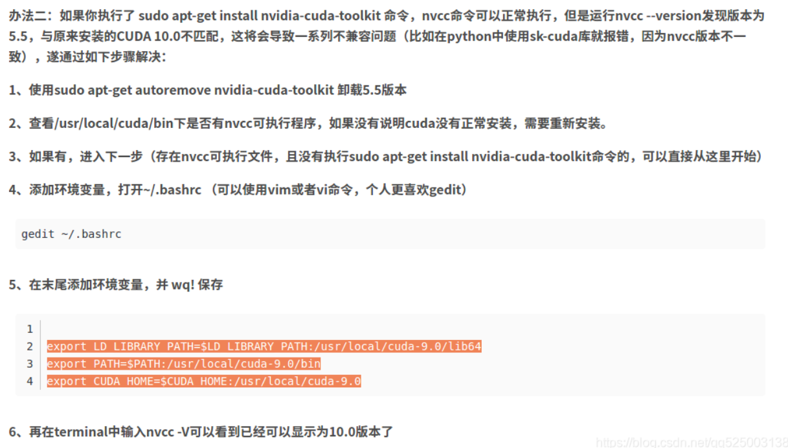

# cuda 多版本注意事项	[网上参照](https://blog.csdn.net/elegantoo/article/details/105574133)
1. 安装cuda时不要安装驱动`drive`
2. 如果打算使用新安装的cuda则添加软链接`symbolic`
3. 安装完cuda，别忘了cudnn也要装上
4. 在/usr/local下 `stat cuda`查看软链接所指向的cuda版本
5. `nvcc -V`查看nvcc版本
6. `cat /usr/local/cuda/version.txt`查看cuda版本
>nvcc与cuda版本要相同，因为就是cuda中的nvcc  
>   - 不匹配解决措施
7. `cat /usr/local/cuda/include/cudnn.h | grep CUDNN_MAJOR -A 2`查看cudnn版本，要匹配cuda
8. 卸载：`sudo /usr/local/cuda-10.2/bin/cuda-uninstaller`，看对应版本
9. `nvidia-smi`查看驱动版本及显存等信息
10. `sudo rm -rf /usr/local/cuda `#删除之前创建的软链接
- `sudo ln -s /usr/local/cuda-10.0 /usr/local/cuda `#创建新 cuda-10.0 的软链接
>通过更改软链接指定cuda版本
