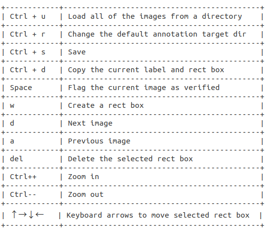
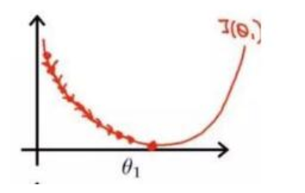

# 数据集训练
## 数据集
1. VOC数据集格式：[test.py](https://blog.csdn.net/qq_42008963/article/details/120189097)
- ─VOCdevkit
    - └─VOC2007
        - │  test.py `用来生成ImageSets中的train.txt和val.txt`
        - ├─Annotations `存放labelImg标注后的标签文件`
            - └─train
                - └─x1.xml
        	- └─val
        		- └─x2.xml
        - ├─ImageSets
        	- └─Main
        	 	- └─train.txt
        	 	- └─val.txt
        - └─JPEGImages `存放图片文件`
        	- └─train
        	 	- └─x1.jpg
        	- └─val
        	   	- └─x2.jpg
2. COCO数据集格式：
- Root
	- images
		- train2017  
			- *.jpg
		- val2017  
			- *.jpg
	- labels  `存放labelImg标注得到的标签文件`
		- train2017
			- *.jpg
		- val2017
			- *.jpg

3. YOLO数据集格式：[VOC转YOLO代码](https://blog.csdn.net/qq_42008963/article/details/120189097)
- Root
	- train
		- *.jpg  
		- *.txt
	- val
		- *.jpg  
		- *.txt
	- aug	`数据增强处理`
		- *.py

	- classes.txt	`类别`

	#### 数据增强处理
		-  [catch_frame](aug/catch_frame.py)		`重新找了一个代码，成功`
			- 用于从视频中抓取图片
		-  [copy](aug/copy.py)
		-  [data_aug](aug/data_aug.py)		`将copy删除后成功`
			- 注意 `copy`和`data_aug`中数据增强执行次数的统一
		-  [img_flipx](aug/img_flipx.py)		`成功`
		-  [img_scale](aug/img_scale.py)		`成功`
>### 训练集与测试集5：1左右，使用cp命令实现数据集和标签的灵活转移
---
## labelImg
- 在labelImg文件夹下``python3 labelImg.py``
1. 步骤
    - 打开labelImg在View中勾选`Auto Save mode(切换到下一张图片时，就会自动把上一张标注的图片标签自动保存下来)`、`Display Labels(标注好图片之后，会把框和标签都显示出来)`、`Advanced Mode(标注的十字架会一直悬浮在窗口)`

	
2. 快捷键

	

3. 标签中的数字

	-  `2` &emsp; `0.459459` &emsp; `0.475000` &emsp; `0.462462` &emsp; `0.130000`
	-   └类别 &emsp;└框中心x&emsp;└框中心y&emsp;└框的宽度w&emsp;└框的高度h
---
## 其他
1. 学习率`learning rate`

	合适的学习率可以保证每轮完整训练之后loss都减小，且能在一段时间后降到一个较低的程度。

	
	>学习率小，loss减小的速度很慢

	
	>学习率过大，在最低点附近来回震荡，甚至无法收敛。

	
	>固定学习率当达到收敛状态时，会在最优值附近一个较大的区域内摆动；学习率衰减会使得收敛时在最优值附近更小的区域内摆动。

	
2. batch_size增大，epoch适当增大
3. yolov5 cfg文件解读

		lr0: 0.01  # 初始学习率 (SGD=1E-2, Adam=1E-3)
		lrf: 0.2  # 循环学习率 (lr0 * lrf)
		momentum: 0.937  # SGD momentum/Adam beta1 学习率动量
		weight_decay: 0.0005  # 权重衰减系数 
		warmup_epochs: 3.0  # 预热学习 (fractions ok)
		warmup_momentum: 0.8  # 预热学习动量
		warmup_bias_lr: 0.1  # 预热初始学习率
		box: 0.05  # iou损失系数
		cls: 0.5  # cls损失系数
		cls_pw: 1.0  # cls BCELoss正样本权重
		obj: 1.0  # 有无物体系数(scale with pixels)
		obj_pw: 1.0  # 有无物体BCELoss正样本权重
		iou_t: 0.20  # IoU训练时的阈值
		anchor_t: 4.0  # anchor的长宽比（长:宽 = 4:1）
		# anchors: 3  # 每个输出层的anchors数量(0 to ignore)
		#以下系数是数据增强系数，包括颜色空间和图片空间
		fl_gamma: 0.0  # focal loss gamma (efficientDet default gamma=1.5)
		hsv_h: 0.015  # 色调 (fraction)
		hsv_s: 0.7  # 饱和度 (fraction)
		hsv_v: 0.4  # 亮度 (fraction)
		degrees: 0.0  # 旋转角度 (+/- deg)
		translate: 0.1  # 平移(+/- fraction)
		scale: 0.5  # 图像缩放 (+/- gain)
		shear: 0.0  # 图像剪切 (+/- deg)
		perspective: 0.0  # 透明度 (+/- fraction), range 0-0.001
		flipud: 0.0  # 进行上下翻转概率 (probability)
		fliplr: 0.5  # 进行左右翻转概率 (probability)
		mosaic: 1.0  # 进行Mosaic概率 (probability)
		mixup: 0.0  # 进行图像混叠概率（即，多张图像重叠在一起） (probability)
---
## 训练
- yolov5

`python train.py --weights yolov5m.pt --hyp data/hyps/hyp.scratch.yaml --data data/coco128.yaml --cfg models/yolov5m.yaml --epochs 30 --batch-size 8 --name 'hair_and_glass'`
>命令行中的参数即超参数`需要在训练之前给定的参数，而不是训练得到的参数`
1. 训练前需要修改  
	`data/hyps/hyp.scratch.yaml` 根据训练结果修改超参数  
	`data/coco128.yaml` 指向你的数据集，改为需要的类别和数目  
	`models/yolov5m.yaml` 修改类别数目  
	`epochs` 训练的次数  
	`batch-size` 几张图片一起训练  
	`--name` 训练后文件夹的名字
2. 训练后关注参数  
	`metrics/mAP_0.5:0.95` 超过0.8  
	`metrics/mAP_0.5` 超过0.6  
	`*_loss` 收敛
3. WandB  
	yolov5自动链接WandB，只需提前本机登陆过账号`wandb login`
4. ### yolov5[训练过程](https://blog.csdn.net/qq_38330148/article/details/109340530)
