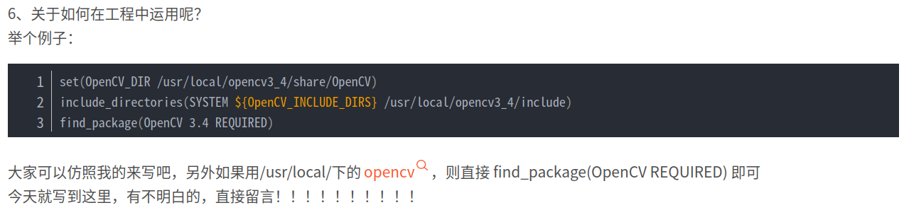
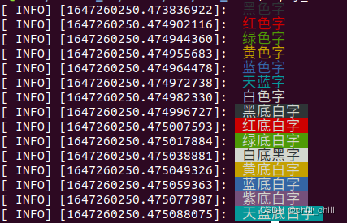

<!-- @format -->

# ros 入门操作

[使用 Vscode 开发 ROS](https://www.cnblogs.com/robohou/p/12988773.html)

1. 创建工作空间
   - `mkdir -p review/src`
   - `catkin_init_workspace`(src 下初始化工作空间)
   - `cd ..`
   - `catkin_make`(ws 下编译)
2. 创建功能包 - `cd src` - `catkin_create_pkg filename rospy roscpp std_msgs`
   > 编译都在 ws 文件夹下进行，之后 source 一下再运行
3. CMakeLists.txt(具体参考[ros 官网](http://wiki.ros.org/catkin/CMakeLists.txt))

   - Required CMake Version (`cmake_minimum_required`)

   - Package Name (`project()`)

   - Find other CMake/Catkin packages needed for build (`find_package()`)

   - Enable Python module support (`catkin_python_setup()`)

   - Message/Service/Action Generators (`add_message_files(), add_service_files(), add_action_files()`)

   - Invoke message/service/action generation (`generate_messages()`)

   - Specify package build info export (`catkin_package()`)

   - Libraries/Executables to build (`add_library()/add_executable()/target_link_libraries()`)

   - Tests to build (`catkin_add_gtest()`)

   - Install rules (`install()`)
     > CMakeLists.txt 添加：  
     > find_package(catkin REQUIRED COMPONENTS  
     >  roscpp  
     >  rospy  
     >  sensor_msgs  
     >  std_msgs  
     >  cv_bridge  
     >  image_transport  
     > )  
     > find_package(OpenCV REQUIRED)  
     > find_package(Eigen3 REQUIRED)  
     > include_directories(  
     >  #include  
     >  (这里有一个美元符){catkin_INCLUDE_DIRS}  
     > /usr/include/eigen3  
     > )  
     > add_executable(QRdetected src/qr.cpp)#用 qr.cpp 生成可执行文件 QRdetected  
     > target_link_libraries(QRdetected (这里有一个美元符){catkin_LIBRARIES} (这里有一个美元符){OpenCV_LIBS})#生成可执行文件 qr 需要后面两个库

   [多版本 opencv](https://blog.csdn.net/qq_43525260/article/details/106564405)

   

> > > package.xml 添加对应依赖 4. [自定义 msg/srv](https://blog.csdn.net/u013453604/article/details/72903398)
> > > CMakeLists.txt 添加：

    find_package(catkin REQUIRED COMPONENTS

message_generation  
 )  
 add_message(service)\_files(  
 FILES  
 Test.msg(\*.srv)  
 )  
 #generate_messages 必须在 catkin_package 前面  
 generate_messages(  
 DEPENDENCIES  
 geometry_msgs(看自己定义的类型)  
 )  
 catkin_package(  
 CATKIN_DEPENDS  
 message_runtime  
 )  
 add_dependencies(QRdetected ${PROJECT_NAME}\_generate_messages_cpp(gencpp))

> > > package.xml 添加：

    <build_depend>message_generation</build_depend>
    <exec_depend>message_runtime</exec_depend>

5.  ros 常用命令(详细查看[ros 官网](http://wiki.ros.org/cn/ROS/Tutorials))

    - 节点
      - 查看 rosnode 所有操作 `rosnode -h`
      - 启动节点 `rosrun package-name executable-name`
      - 查看节点列表 `rosnode list`
    - 功能包
      - 查看 rospack 所有操作 `rospack -h`
      - 查找包 `rospack find package-name`
      - 查看包依赖 `rospack depends package-name`
    - 话题
      - 查看 rostopic 所有操作 `rostopic -h`
      - 查看话题列表 `rostopic list`
      - 图形化显示 `rosrun rqt_graph rqt_graph`和`rosrun rqt_plot rqt_plot`
      - 查看某个话题信息 `rostopic echo [topic]`
      - 查看话题消息格式 `rostopic type [topic]`和`rosmsg show [msg_type]`
      - 向话题发布信息 `rostopic pub [-1] <topic> <msg_type> [-r 1] -- [args] [args]`
    - 服务

      - 查看 rosservice 所有操作 `rosservice -h`
      - 查看服务列表 `rosservice list`
      - 调用服务 `rosservice call [service][args]`
      - 查看 service 格式并显示数据 `rosservice type [service] | rossrv show`

    - 参数
      - 查看 rosparam 所有操作 `rosparam -h`
      - 设置服务参数 `rosparam set [parame_name] [args] + rosservice call clear`
      - 获得参数 `rosparam get [parame_name]`
      - 加载参数 `rosparam load [file_name] [namespace]`
      - 删除参数 `rosparam delete`
    - 数据包
      - 查看 rosbag 所有操作 `rosbag -h`
      - 记录所有话题变化 `rosbag record -a`
      - 记录某些话题变化 `rosbag record -O subset <topic1> <topic2>`
      - 查看数据包信息 `rosbag info <bagfile_name>`
      - 回放 `rosbag play (-r 2) <bagfile_name>`
    - launch 文件标签([ros 官网](http://wiki.ros.org/roslaunch/XML))
      - `<node pkg="功能包名" type="可执行文件名" name="节点名">`
      - `<param name="参数名" value="参数值">`
      - `<rosparam file="参数服务器名" command="load|dump|delete" ns="命名空间名">`
      - `<arg name="参数名" default="默认参数值">`
      - `<remap from="原名名"to="映射之后的命名">`
      - `<include file="其他launch文件路径">`
    - QT 工具箱
      - rqt_console(日志输出工具)
      - rqt_graph(计算图可视化工具)
      - rqt_plot(数据绘图工具)
      - rqt_image_view(图像渲染工具)
    - Rviz([数据显示平台](http://wiki.ros.org/rviz/UserGuide))
    - Gazebo([数据仿真平台](http://wiki.ros.org/gazebo_ros_pkgs))

6.  [launch 文件](https://www.cnblogs.com/Jessica-jie/p/6961837.html)\
    ❀ 标签

         ☺ <node> 启动一个节点
        - <node name="node_name" pkg="package_name" type="execulte_name"></node>
         ☺ <param> 设置参数服务器的参数
        - <param name="param_name" value=""></param>
         ☺ <remap> 重映射
         ☺ <machine> 声明启动要使用的机器
         ☺ <include> 包含的launch文件
         ☺ <group> 共享一个命名空间或者映射的元素组
         ☺ <args> 声明参数(函数型参)

    ❀ node 属性

         pkg 节点包
         type节点类型，必须要有对应的可执行文件
         name节点名称
         args 传递到节点的参数
         respawn 自动重启

    `pkg、type可在/catkin_ws/devel/lib 文件夹下看到`

> 我的理解：对于一个<node>命令，即使在子级下面定义其他的参数（如：args/param/remap） ,要求<node>与</node>之间只允许出现一个代表结束此 node 内容的“/”，而在其中定义的其他参数（如：args/param/remap）作为一个独立的命令行，可以有自己的结束“/” 7. [action 通讯](http://wiki.ros.org/cn/actionlib) 8. [param 参数服务器](https://blog.csdn.net/u013528298/article/details/87937555)

    - launch文件
    	- 利用标签`<param>`和`<rosparam>`设置参数或导入参数
    - yaml文件
    	- 写好后在launch中`<rosparam file="$(find package_name)/param/param.yaml" command="load"></rosparam>`
    - node源码
    - 命令行操作

9. [ROS_INFO 颜色](https://blog.csdn.net/chill_chill/article/details/123485949)

- ROS_INFO_STREAM("\033[30m 黑色字 \033[0m");
- ROS_INFO_STREAM("\033[31m 红色字 \033[0m");
- ROS_INFO_STREAM("\033[32m 绿色字 \033[0m");
- ROS_INFO_STREAM("\033[33m 黄色字 \033[0m");
- ROS_INFO_STREAM("\033[34m 蓝色字 \033[0m");
- ROS_INFO_STREAM("\033[36m 天蓝字 \033[0m");
- ROS_INFO_STREAM("\033[37m 白色字 \033[0m");
- ROS_INFO_STREAM("\033[40;37m 黑底白字 \033[0m");
- ROS_INFO_STREAM("\033[41;37m 红底白字 \033[0m");
- ROS_INFO_STREAM("\033[42;37m 绿底白字 \033[0m");
- ROS_INFO_STREAM("\033[47;30m 白底黑字 \033[0m");
- ROS_INFO_STREAM("\033[43;37m 黄底白字 \033[0m");
- ROS_INFO_STREAM("\033[44;37m 蓝底白字 \033[0m");
- ROS_INFO_STREAM("\033[45;37m 紫底白字 \033[0m");
- ROS_INFO_STREAM("\033[46;37m 天蓝底白字 \033[0m");

- 

- \033[0m 关闭所有属性
- \033[1m 设置高亮度
- \033[4m 下划线
- \033[5m 闪烁
- \033[7m 反显
- \033[8m 消隐
- \033[30m -- \33[37m 设置前景色
- \033[40m -- \33[47m 设置背景色
- \033[nA 光标上移 n 行
- \033[nB 光标下移 n 行
- \033[nC 光标右移 n 行
- \033[nD 光标左移 n 行
- \033[y;xH 设置光标位置
- \033[2J 清屏
- \033[K 清除从光标到行尾的内容
- \033[s 保存光标位置
- \033[u 恢复光标位置
- \033[?25l 隐藏光标
- \033[?25h 显示光标
