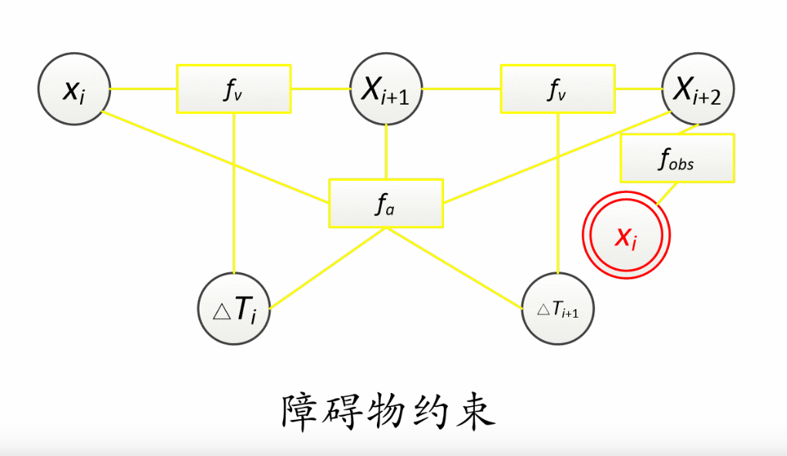
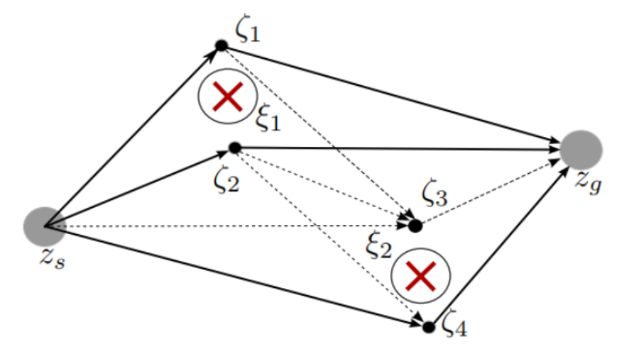

# TEB (time eletic band)  [参考教程](https://charon-cheung.github.io/categories/%E8%B7%AF%E5%BE%84%E8%A7%84%E5%88%92/TEB%E7%AE%97%E6%B3%95)

  - 待估计参数(顶点) : 位姿、时间差
  - 边 : 目标函数
  
  - 优化器 : 
      - CSparse
      - CHOLMOD
  - 规划器
      - TebOptimalPlanner
      - HomotopyClassPlanner

## HomotopyClassPlanner
  - 使用DepthFirstSearch(DFS)搜索所有路径
  - 一次同时优化多条trajectory，最终在备选局部解的集合中选择最优解
  - 就像是多个TebOptimalPlanner类实例的组合
  - 会使用probabilistic roadmap(PRM)算法在障碍物周边采样一些keypoints，然后构建一个网格
  